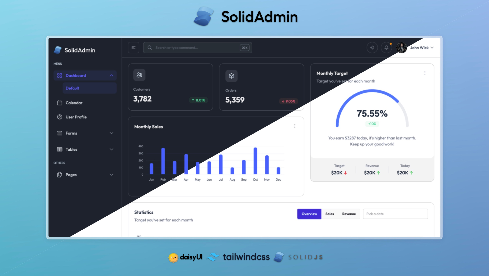

# SolidAdmin - Free Tailwind Admin Dashboard Template

SolidAdmin is a high-quality, open-source, and **free Tailwind CSS admin template** that is perfect for creating data-rich backends,
powerful web applications and dashboard-admin projects. This project is based on the [TailAdmin](http://tailadmin.com/) project.



## Overview

SolidAdmin provides essential UI components and layouts for building feature-rich, data-driven admin dashboards and control panels. It's built using:

- HTML
- SolidJS
- Tailwind CSS
- DaisyUI
- and Rsbuild (for bundling)

### Demos

- [SolidAdmin Demo](https://solid-admin-murex.vercel.app)

## Installation

### Prerequisites

To get started with SolidAdmin, ensure you have the following prerequisites installed and set up:

- Node.js 18.x or later

### Cloning the Repository

Clone the repository using the following command:

```bash
git clone https://github.com/astrawan/solid-admin.git
```

> Windows Users: place the repository near the root of your drive if you face issues while cloning.

1. Install dependencies:

   ```bash
   npm install
   # or
   yarn install
   ```

2. Start the development server:

   ```bash
   npm run dev
   # or
   yarn dev
   ```

## Components

SolidAdmin is a pre-designed starting point for building a web-based dashboard using HTML, SolidJS and Tailwind CSS. The template includes:

- Sophisticated and accessible sidebar
- Data visualization components
- Prebuilt profile management and 404 page
- Tables and Charts(Line and Bar)
- Authentication forms and input elements
- Alerts, Dropdowns, Modals, Buttons and more
- Can't forget Dark Mode 🕶️

## License

The community edition of SolidAdmin is released under the MIT License.

## Support

If you find this project helpful, please consider giving it a star on GitHub. Your support helps us continue developing and maintaining this template.
